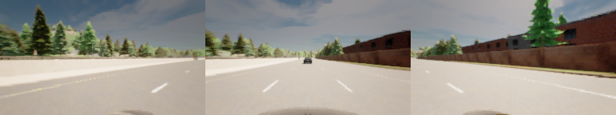
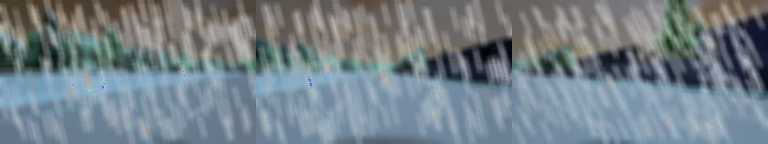
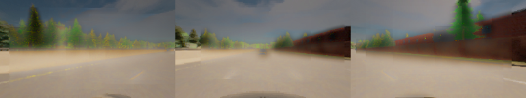
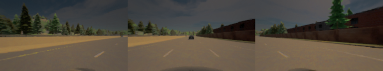

# Out-of-Distribution Detection and Fallback for Autonomous Vehicles
### Abstract
Handling out-of-distribution (OOD) scenarios remains a challenge in autonomous vehicles as more safety-related issues emerge. In the field of machine learning, OOD cases occur when a learned model encounters input that is not included in training, potentially resulting in decision-making failures. These OOD situations can manifest in various ways, but this project focuses specifically on OOD scenarios involving varying weather conditions that affect adverse weather, which can significantly distort visual inputs and sensor data. As the industry shifts towards end-to-end vision-based autonomous driving that increasingly relies on visual data, robust handling of OOD input becomes crucial. Current learning-based approaches to OOD detection, like RIP, are limited in their robustness and interpretability. Thus, our project aims to implement a statistical analysis to first detect OOD and then enable the fallback mode that encourages safer driving behaviors. We introduce three weather modifications that inject up to 100% more accidents and 50% change in vehicle route among all weathers on the baseline autonomous driving agent. We also proposed two OOD detection methods that can detect OOD with an accuracy of up to 92%. Finally, we achieved up to 50% reduction in collision score and 46% in route-change proportion with modified weather by enabling the fallback mode to promote safer driving actions when OOD is detected using our method.

### Example

  
Some example images that provide a clear comparison of the modifications, showing visual impact to various degrees. *Top to bottom: original, rain, haze, shade.*

### File Descriptions
1. `/deliverables`: project report and presentation
2. `/camera_input_source`: data collected from 11 variants of the "lead slowdown" scenario. All are without accidents. 
3. `/image_noise_modification`: weather modification scripts on original image
4. `/Distribution`: Mahanolobis Distance based OOD detection and Autoencoder based OOD detection.
5. `\testing`:
    1. OOD detection testing
    2. Fallback mode testing
6. `\analysis`: Fallback mode result analysis
7. `image_agent.py`: [Learning-by-Cheating](https://github.com/dotchen/LearningByCheating) agent. Takes an image as input and outputs an action. This project also adds OOD detection and fallback methods. 

### Contributions
1. Testing and modifying OOD detection method and fallback mode.
2. Integrating OOD detection method and fallback mode into the pipeline.
3. Designing and running experiments.
